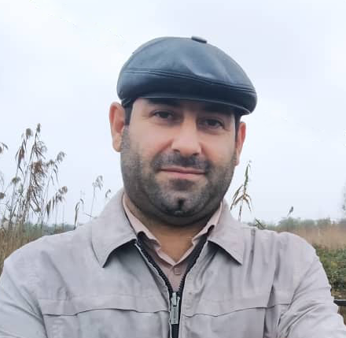

eskandari  at guilan dot ac dot ir

[[Google Scholar]](https://scholar.google.com/citations?user=y-LsrFEAAAAJ&hl=en)   [[Academic Website]](https://staff.guilan.ac.ir/eskandari/index.php?a=0&lg=1)   [[Linkedin]](https://www.linkedin.com/in/sadegh-eskandari-3b87797a/?lipi=urn%3Ali%3Apage%3Ad_flagship3_feed%3BjkotFxg1TcWy5h66FPj2LA%3D%3D)

# About

I'm broadly interested in machine learning. I am currently an Assistant Professor at [Department of Computer Science](https://guilan.ac.ir/en/department-of-computer-sciences), [University of Guilan](https://guilan.ac.ir/en/home), Rasht, Iran. 
I received my Ph.D. in applied mathematics from Shahid Bahonar University of Kerman, under supervision of professor [Mohammad Masoud Javidi](http://compsci.uk.ac.ir/en/~javidi). Before that, I spent six months at Middle East Technical University (METU),  working with professor [Emre Akbas](http://user.ceng.metu.edu.tr/~emre/).  

I received my MSc in Computer Science from Shahid Bahonar University of Kerman, where I worked on intelligent supply chain managements systems under supervision of professor [Marjan Kuchki Rafsanjani](http://compsci.uk.ac.ir/en/~kuchaki). I have also worked as a base station transmitter (BTS) maintenance expert at [ICT-TCI](https://www.tci.ir/) (Mazandaran Branch) for two years. 

# News
* 2021/12/27: Two papers acceptd to appear in [csc2021](http://csc.guilan.ac.ir/Home).
* 2021/11/27: I will be serving in the organization committee of the [9th Seminar on Numerical Analysis and Its Applications](http://snaa9.guilan.ac.ir/Home/Index)
* 2021/11/7: Two papers acceptd to appear in [i4c2021](http://i4c.iust.ac.ir/index.php?option=com_content&view=article&id=7&Itemid=124&lang=en).
* 2021/9/14: Our joint work with Prof.Salahi and ALi Sahleh (phd student)  accepted to appear in [Applied Intelligence](https://www.springer.com/journal/10489): "SOCP Approach to Robust Twin Parametric Margin Support Vector Machine".
* 2021/8/2: I will teach a new graduate course "Mathematical Foundations of Data Science" in Fall 2021
* 2021/4/22: Paper accepted to appear in Journal of Mathematical Modeling (JMM): ["Streamwise feature selection on big data using noise resistant rough functional dependency"](https://jmm.guilan.ac.ir/article_4761.html) 
* 2021/1/21: Paper accepted to appear in Journal of Mathematical Modeling (JMM): ["An Intrusion Detection System with a Parallel Multi-Layer Neural Network"](https://jmm.guilan.ac.ir/article_4608.html) 

# Teaching
* Mathematical Foundations of Data Science (Graduate) (Fall 2021)
* Topics in Machine Learning (Graduate, co-taught with [Prof.Salahi](https://scholar.google.com/citations?user=8cXhHrsAAAAJ&hl=en)) (Spring 2020)
* Artificial Intelligence (Undergraduate) [(Fall 2021)](https://sadegh28.github.io/AI1400-1/)[(Fall 2020)](https://sadegh28.github.io/AI99001/)(Fall 2019)(Fall 2018)(Fall 2017)(Fall 2016) 
* Advanced Progarmming (Undergraduate) [(Fall 2021)](https://sadegh28.github.io/AP1400-1/)[(Spring 2020)](https://sadegh28.github.io/AP99002/)[(Fall 2020)](https://sadegh28.github.io/AP99001/)[(Spring 2020)](https://sadegh28.github.io/AP98992/)(Fall 2019)(Spring 2019)(Fall 2018)(Spring 2018)(Fall 2017)(Spring 2017)(Fall 2016)(Spring 2016)   

# Honors 
* Best E-teacher of the Faculty of Mathematical Science, 2020. 
* Best teacher of the Department of Computer Science (from students point of view) 2018. 
* MSRT (Ministry of Science, Research and Technology) PHD scholarship award, 2015.
* Best faculty researcher prize at Shahid Bahonar University of Kerman, 2014.
* Best faculty researcher prize at Shahid Bahonar University of Kerman, 2016.
* First rank during master studies.

# Activity
* Assistant Professor, [Department of Computer Science, Universtiy of Guilan](https://guilan.ac.ir/en/department-of-computer-sciences), 2016 -- present 
* Sabbatical at the Vision Lab, Middle East Technical University(METU or ODTU), 2016
* Editorial Board [Big Data and Computing Visions (BDCV)](https://www.bidacv.com/)
* Refereed papers for [Information Sciences](https://www.journals.elsevier.com/information-sciences), [International Journal of Approximate Reasoning](https://www.journals.elsevier.com/international-journal-of-approximate-reasoning), [Congnitive Computation](https://link.springer.com/journal/12559), [cifs2022](https://cfis2022.bam.ac.ir/) and [Iranian Journal of Fuzzy Systems](http://ijfs.usb.ac.ir/).

# Research Interests
* Artificial Intelligence 
* Machine Learning 
* Deep Learning

# Graduate Students
* [Ali Sahleh](https://www.linkedin.com/in/ali-sahleh-45a4b3159/): PhD Student (co-advised with [Prof.Salahi](https://scholar.google.com/citations?user=8cXhHrsAAAAJ&hl=en))
* Faezeh Hassani: MsC Student (co-advised with [Prof.Salahi](https://scholar.google.com/citations?user=8cXhHrsAAAAJ&hl=en))

