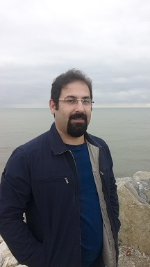

 

eskandari  at guilan dot ac dot ir

[[Google Scholar]](https://scholar.google.com/citations?user=y-LsrFEAAAAJ&hl=en)   [[Academic Website]](https://staff.guilan.ac.ir/eskandari/index.php?a=0&lg=1)   [[Linkedin]](https://www.linkedin.com/in/sadegh-eskandari-3b87797a/?lipi=urn%3Ali%3Apage%3Ad_flagship3_feed%3BjkotFxg1TcWy5h66FPj2LA%3D%3D)

# About

I'm broadly interested in machine learning. I am currently an Assistant Professor at University of Guilan, Rasht, Iran. 
I recieved my PhD in applied mathematics from Shahid Bahonar University of Kerman, under supervision of professor [Mohammad Masoud Javidi](http://compsci.uk.ac.ir/en/~javidi). Before that, I spent a six month at Middle East Technical University (METU),  working with professor [Emre Akbas](http://user.ceng.metu.edu.tr/~emre/).  

I received my MSc in Computer Science from Shahid Bahonar University of Kerman, where I worked on intelligent supply chain managements systems under supervision of professor [Marjan Kuchki Rafsanjani](http://compsci.uk.ac.ir/en/~kuchaki). I have also worked as a base station transmitter (BTS) maintenance expert at [ICT-TCI](https://www.tci.ir/) (Mazandaran Branch) for two years.   
